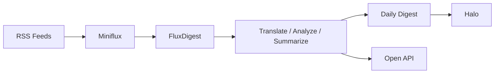

# FluxDigest

> 基于 Miniflux 的自托管 AI RSS 日报平台：抓取订阅文章，逐篇翻译分析，最终生成一篇每日汇总日报，并可发布到 Halo 或通过 API 对外提供结果。

## Welcome

FluxDigest 面向个人自托管场景，核心链路非常简单：

- **Miniflux** 管理 RSS 订阅与抓取
- **FluxDigest** 调用你配置的 LLM 完成翻译、分析、总结
- **输出** 同时覆盖单篇文章结果、每日汇总日报、Halo 发布与开放接口



如果你已经在用 Miniflux，但不想每天自己消化所有订阅内容，FluxDigest 负责把“订阅流”整理成“可读日报 + 可复用单篇分析结果”。

## Feature

### Core Workflow
- 从 Miniflux 拉取最新 RSS 文章
- 对每篇文章执行翻译、润色、分析与 dossier 生成
- 汇总全部处理结果，生成一篇每日汇总日报
- 保留单篇文章结果，供 API 或其他系统继续消费

### Publishing & Output
- 将每日汇总日报发布到 Halo
- 保留单篇翻译 / 分析结果供外部系统查询
- 支持开放接口读取 articles / dossiers / digests
- 记录发布状态与后续处理结果

### Admin & WebUI
- WebUI 配置 LLM、Miniflux、发布通道、提示词
- 管理连接测试、运行状态与常用入口
- 提供 Miniflux 后台跳转入口
- 支持后续扩展更多发布器与输出策略

### Deployment
- Linux + Docker 优先的自托管部署方式
- 仓库根目录唯一公开入口：`install.sh`
- 同一个脚本覆盖安装、升级、回滚、状态查看
- 交互式菜单适合首次部署和个人自用场景

## Quick Start

### 1. 一键启动安装器（推荐）

如果你只是想在 Linux 机器上快速拉起完整环境，直接执行：

```bash
curl --noproxy ghproxy.vip -fsSL https://ghproxy.vip/https://raw.githubusercontent.com/ErzerLP/FluxDigest/master/install.sh | bash
```

如果你的服务器平时需要先执行 `fuck` 打开代理，再运行：

```bash
bash -ic 'fuck; curl --noproxy ghproxy.vip -fsSL https://ghproxy.vip/https://raw.githubusercontent.com/ErzerLP/FluxDigest/master/install.sh | bash'
```

> 根入口会优先尝试本地源码；当本地源码不存在时，会自动从 GitHub / 镜像下载完整源码后继续安装。

### 2. 准备依赖

在 Linux 主机上准备以下命令：

- `docker`
- `docker compose`
- `curl`
- `whiptail`

> 安装脚本会自动检测依赖，但不会自动替你安装缺失组件。

### 3. 如果你已经 clone 了仓库

```bash
git clone https://github.com/ErzerLP/FluxDigest.git
cd FluxDigest
bash install.sh
```

脚本启动后会进入交互菜单，你可以用：

- **方向键上下选择**
- **Tab 切换按钮**
- **Enter 确认**

支持的部署组合包括：

- `FluxDigest + Miniflux + Halo`
- `FluxDigest + Miniflux`
- `FluxDigest + Halo`
- `FluxDigest only`

### 4. 安装完成后你会拿到这些信息

脚本会输出并保存安装摘要，包含：

- FluxDigest WebUI / API 地址
- Miniflux 地址
- Halo 地址
- FluxDigest / Miniflux / Halo 默认管理员账号密码
- PostgreSQL 与 Redis 连接信息
- `.env`、`docker-compose.yml`、`install-summary.txt` 路径

### 5. 首次使用流程

1. 登录 **FluxDigest WebUI**
2. 配置 **LLM Base URL / API Key / Model**
3. 进入 **Miniflux 后台** 添加 RSS 订阅源
4. 配置 **Halo 发布通道**（如启用）
5. 触发日报或等待定时任务执行

## Documentation

- 完整部署说明：[`docs/deployment/full-stack-ubuntu.md`](docs/deployment/full-stack-ubuntu.md)
- 安装器高级参数与动作说明：[`docs/deployment/installer-reference.md`](docs/deployment/installer-reference.md)
- 首次接入与联调：[`docs/deployment/integration-setup.md`](docs/deployment/integration-setup.md)
- 开放接口说明：[`docs/api/open-api-guide.md`](docs/api/open-api-guide.md)
- OpenAPI：[`api/openapi/openapi.yaml`](api/openapi/openapi.yaml)
