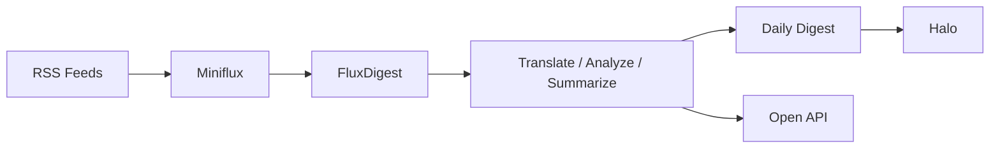

# Single Installer and README Refresh Implementation Plan

> **For agentic workers:** REQUIRED SUB-SKILL: Use superpowers:subagent-driven-development (recommended) or superpowers:executing-plans to implement this plan task-by-task. Steps use checkbox (`- [ ]`) syntax for tracking.

**Goal:** Replace the current multi-entry deployment surface with one Docker-first interactive `install.sh`, then rewrite the README homepage around `Welcome / Feature / Quick Start` so first-time users can deploy FluxDigest from a single obvious entrypoint.

**Architecture:** Keep the existing `deploy/stack/` Docker installer as the internal engine, but extend it with action-based release metadata (`install / upgrade / rollback / status`) and release-tagged images so rollback works for Docker deployments too. Add a root-level `install.sh` that owns the user interaction via `whiptail`, then rewrite the top-level docs so every primary onboarding path points to that single script.

**Tech Stack:** Bash, whiptail, Docker Compose, Markdown docs

---

## File Map

### Create
- `install.sh` — the only public installer entrypoint; launches the interactive menu and dispatches to the internal stack installer.
- `deploy/stack/tests/install_release_actions_smoke.sh` — smoke coverage for stack `install / upgrade / rollback / status` behavior with mocked Docker.
- `deploy/stack/tests/root_install_menu_smoke.sh` — smoke coverage for the interactive root installer using mocked `whiptail` and a mocked stack installer.
- `deploy/stack/tests/docs_quickstart_smoke.sh` — assertions that README and deployment docs reflect the new single-entry onboarding path.
- `docs/deployment/installer-reference.md` — details for advanced installer usage, actions, and hidden non-interactive flags.

### Modify
- `deploy/stack/install.sh` — add action dispatch, release tagging, release snapshot history, status output, and rollback restore logic.
- `deploy/stack/docker-compose.yml.tpl` — parameterize FluxDigest image names by release-tag variables instead of hard-coded `:latest` tags.
- `deploy/stack/stack.env.tpl` — persist release metadata and release-tagged image variables.
- `deploy/stack/tests/install_mocked_smoke.sh` — align baseline mocked install coverage with the new action/release variables.
- `deploy/stack/tests/install_existing_env_smoke.sh` — assert upgrade/install paths still preserve existing secrets after action support is added.
- `README.md` — rewrite homepage to `Welcome / Feature / Quick Start` and center the root `install.sh` path.
- `docs/deployment/full-stack-ubuntu.md` — convert the full deployment guide from manual/systemd flow to the new Docker-first single-installer flow.
- `docs/deployment/integration-setup.md` — tighten first-use guidance so it starts after `bash install.sh` completes and references the generated install summary.

### Validation Commands Used Across Tasks
- `bash deploy/stack/tests/install_release_actions_smoke.sh`
- `bash deploy/stack/tests/root_install_menu_smoke.sh`
- `bash deploy/stack/tests/docs_quickstart_smoke.sh`
- `bash deploy/stack/tests/install_mocked_smoke.sh`
- `bash deploy/stack/tests/install_existing_env_smoke.sh`
- `bash deploy/stack/tests/render_smoke.sh`
- `bash -n install.sh deploy/stack/install.sh`
- `go test ./...`

### Task 1: Extend the internal Docker stack installer with actions and release history

**Files:**
- Modify: `deploy/stack/install.sh`
- Modify: `deploy/stack/docker-compose.yml.tpl`
- Modify: `deploy/stack/stack.env.tpl`
- Modify: `deploy/stack/tests/install_mocked_smoke.sh`
- Modify: `deploy/stack/tests/install_existing_env_smoke.sh`
- Create: `deploy/stack/tests/install_release_actions_smoke.sh`

- [ ] **Step 1: Write the failing release-actions smoke test**

```bash
#!/usr/bin/env bash

set -euo pipefail

SCRIPT_DIR="$(cd "$(dirname "${BASH_SOURCE[0]}")" && pwd)"
source "${SCRIPT_DIR}/../scripts/common.sh"

TMP_DIR="$(mktemp -d)"
WORK_DIR="${TMP_DIR}/work"
STACK_DIR_REL="release-stack"
MOCK_BIN="${TMP_DIR}/mock-bin"
MOCK_DOCKER_LOG="${TMP_DIR}/docker.log"
trap 'rm -rf "${TMP_DIR}"' EXIT

mkdir -p "${MOCK_BIN}" "${WORK_DIR}"

cat > "${MOCK_BIN}/docker" <<'EOF'
#!/usr/bin/env bash
set -euo pipefail
printf 'docker %s\n' "$*" >> "${MOCK_DOCKER_LOG:?}"
if [[ "${1:-}" == "compose" || "${1:-}" == "image" ]]; then
  exit 0
fi
exit 0
EOF
chmod +x "${MOCK_BIN}/docker"

cat > "${MOCK_BIN}/openssl" <<'EOF'
#!/usr/bin/env bash
set -euo pipefail
if [[ "${1:-}" == "rand" && "${2:-}" == "-hex" ]]; then
  len="${3:-16}"
  awk -v n="${len}" 'BEGIN { for (i = 0; i < n * 2; i++) printf "b"; printf "\n" }'
  exit 0
fi
if [[ "${1:-}" == "rand" && "${2:-}" == "-base64" ]]; then
  bytes="${3:-24}"
  chars=$(( ((bytes + 2) / 3) * 4 ))
  awk -v n="${chars}" 'BEGIN { for (i = 0; i < n; i++) printf "B"; printf "\n" }'
  exit 0
fi
exit 1
EOF
chmod +x "${MOCK_BIN}/openssl"

export PATH="${MOCK_BIN}:${PATH}"
export MOCK_DOCKER_LOG

# shellcheck source=/dev/null
source "${SCRIPT_DIR}/../install.sh"

ensure_linux() { :; }
wait_for_http_ok() { return 0; }
bootstrap_miniflux() { printf 'miniflux-token\n'; }
bootstrap_halo() { printf 'halo-token\n'; }

export STACK_RELEASE_ID_OVERRIDE="20260415070001"
(
  cd "${WORK_DIR}"
  main --action install --profile fluxdigest-only --stack-dir "${STACK_DIR_REL}" --force
)

STACK_DIR="$(cd "${WORK_DIR}/${STACK_DIR_REL}" && pwd -P)"
grep -q '^FLUXDIGEST_RELEASE_ID=20260415070001$' "${STACK_DIR}/.env" || fail "初始 release ID 未写入 .env"
grep -q '^FLUXDIGEST_API_IMAGE=fluxdigest/api:20260415070001$' "${STACK_DIR}/.env" || fail "API 镜像 tag 未写入"
[[ -f "${STACK_DIR}/releases/20260415070001/.env" ]] || fail "初始 release 快照缺失"

export STACK_RELEASE_ID_OVERRIDE="20260415070002"
(
  cd "${WORK_DIR}"
  main --action upgrade --stack-dir "${STACK_DIR_REL}" --force
)

grep -q '^FLUXDIGEST_RELEASE_ID=20260415070002$' "${STACK_DIR}/.env" || fail "升级后 release ID 未更新"
[[ -f "${STACK_DIR}/releases/20260415070002/.env" ]] || fail "升级 release 快照缺失"

(
  cd "${WORK_DIR}"
  main --action rollback --stack-dir "${STACK_DIR_REL}" --release-id 20260415070001 --force
)

grep -q '^FLUXDIGEST_RELEASE_ID=20260415070001$' "${STACK_DIR}/.env" || fail "回滚后 release ID 未恢复"
grep -q 'Current Release: 20260415070001' "${STACK_DIR}/install-summary.txt" || fail "summary 未显示当前 release"
grep -Eq 'docker compose .*up -d fluxdigest-api fluxdigest-worker fluxdigest-scheduler' "${MOCK_DOCKER_LOG}" || fail "缺少 FluxDigest 服务启动命令"

log_info "install release actions smoke passed"
```

- [ ] **Step 2: Run the new smoke test to verify it fails**

Run: `bash deploy/stack/tests/install_release_actions_smoke.sh`
Expected: FAIL with `未知参数: --action`, missing `FLUXDIGEST_RELEASE_ID`, or missing `releases/<id>` snapshot artifacts.

- [ ] **Step 3: Implement action parsing, release-tagged images, and snapshot helpers in the stack installer**

```bash
STACK_ACTION="${STACK_ACTION:-install}"
STACK_RELEASE_ID_OVERRIDE="${STACK_RELEASE_ID_OVERRIDE:-}"
STACK_RELEASE_ID=""
STACK_RELEASES_DIR=""
STACK_RELEASE_TARGET_ID=""

parse_args() {
  while [[ $# -gt 0 ]]; do
    case "$1" in
      --action)
        [[ $# -ge 2 ]] || fail "--action 缺少参数"
        STACK_ACTION="$2"
        shift 2
        ;;
      --release-id)
        [[ $# -ge 2 ]] || fail "--release-id 缺少参数"
        STACK_RELEASE_TARGET_ID="$2"
        shift 2
        ;;
      --profile)
        [[ $# -ge 2 ]] || fail "--profile 缺少参数"
        STACK_PROFILE="$2"
        shift 2
        ;;
      --stack-dir)
        [[ $# -ge 2 ]] || fail "--stack-dir 缺少参数"
        STACK_DIR="$2"
        shift 2
        ;;
      --force)
        STACK_FORCE=1
        shift
        ;;
      -h|--help)
        STACK_SHOW_HELP=1
        shift
        ;;
      *)
        fail "未知参数: $1"
        ;;
    esac
  done

  case "${STACK_ACTION}" in
    install|upgrade|rollback|status) ;;
    *) fail "不支持的 action: ${STACK_ACTION}" ;;
  esac
}

generate_release_id() {
  if [[ -n "${STACK_RELEASE_ID_OVERRIDE}" ]]; then
    printf '%s\n' "${STACK_RELEASE_ID_OVERRIDE}"
    return 0
  fi
  date -u +'%Y%m%d%H%M%S'
}

set_release_paths() {
  STACK_RELEASES_DIR="${STACK_DIR}/releases"
  export STACK_RELEASES_DIR
}

set_release_image_tags() {
  STACK_RELEASE_ID="$(generate_release_id)"
  export FLUXDIGEST_RELEASE_ID="${STACK_RELEASE_ID}"
  export FLUXDIGEST_API_IMAGE="fluxdigest/api:${STACK_RELEASE_ID}"
  export FLUXDIGEST_WORKER_IMAGE="fluxdigest/worker:${STACK_RELEASE_ID}"
  export FLUXDIGEST_SCHEDULER_IMAGE="fluxdigest/scheduler:${STACK_RELEASE_ID}"
}

snapshot_current_release() {
  local snapshot_id="${1:?}"
  local snapshot_dir="${STACK_RELEASES_DIR}/${snapshot_id}"
  mkdir -p "${snapshot_dir}"
  cp "${STACK_DIR}/.env" "${snapshot_dir}/.env"
  cp "${STACK_DIR}/docker-compose.yml" "${snapshot_dir}/docker-compose.yml"
  cp "${STACK_DIR}/install-summary.txt" "${snapshot_dir}/install-summary.txt"
  printf '%s\n' "${snapshot_id}" > "${STACK_RELEASES_DIR}/current"
}

restore_release_snapshot() {
  local snapshot_id="${1:?}"
  local snapshot_dir="${STACK_RELEASES_DIR}/${snapshot_id}"
  [[ -f "${snapshot_dir}/.env" ]] || fail "找不到 release 快照: ${snapshot_id}"
  cp "${snapshot_dir}/.env" "${STACK_DIR}/.env"
  cp "${snapshot_dir}/docker-compose.yml" "${STACK_DIR}/docker-compose.yml"
  cp "${snapshot_dir}/install-summary.txt" "${STACK_DIR}/install-summary.txt"
  printf '%s\n' "${snapshot_id}" > "${STACK_RELEASES_DIR}/current"
}
```

- [ ] **Step 4: Wire the compose template and summary output to the release metadata**

```yaml
  fluxdigest-api:
    build:
      context: {{STACK_SOURCE_ROOT}}
      dockerfile: {{STACK_SOURCE_ROOT}}/deployments/docker/api.Dockerfile
      network: host
      args:
        http_proxy: ${http_proxy}
        https_proxy: ${https_proxy}
        HTTP_PROXY: ${HTTP_PROXY}
        HTTPS_PROXY: ${HTTPS_PROXY}
        GOPROXY: ${GOPROXY}
        GOSUMDB: ${GOSUMDB}
    image: ${FLUXDIGEST_API_IMAGE}

  fluxdigest-worker:
    image: ${FLUXDIGEST_WORKER_IMAGE}

  fluxdigest-scheduler:
    image: ${FLUXDIGEST_SCHEDULER_IMAGE}
```

```dotenv
FLUXDIGEST_RELEASE_ID={{FLUXDIGEST_RELEASE_ID}}
FLUXDIGEST_API_IMAGE={{FLUXDIGEST_API_IMAGE}}
FLUXDIGEST_WORKER_IMAGE={{FLUXDIGEST_WORKER_IMAGE}}
FLUXDIGEST_SCHEDULER_IMAGE={{FLUXDIGEST_SCHEDULER_IMAGE}}
```

```bash
printf '\nRelease\n' >> "${summary_path}"
printf -- '- Current Release: %s\n' "${FLUXDIGEST_RELEASE_ID}" >> "${summary_path}"
printf -- '- API Image: %s\n' "${FLUXDIGEST_API_IMAGE}" >> "${summary_path}"
printf -- '- Worker Image: %s\n' "${FLUXDIGEST_WORKER_IMAGE}" >> "${summary_path}"
printf -- '- Scheduler Image: %s\n' "${FLUXDIGEST_SCHEDULER_IMAGE}" >> "${summary_path}"
```

- [ ] **Step 5: Update the existing smoke tests to align with the new action model**

```bash
(
  cd "${WORK_DIR}"
  main --action install --profile fluxdigest-only --stack-dir "${STACK_DIR_REL}" --force
)

grep -q '^FLUXDIGEST_RELEASE_ID=' "${env_file}" || fail "缺少 release ID"
grep -q '^FLUXDIGEST_API_IMAGE=fluxdigest/api:' "${env_file}" || fail "缺少 API 镜像 tag"
grep -q '^FLUXDIGEST_WORKER_IMAGE=fluxdigest/worker:' "${env_file}" || fail "缺少 Worker 镜像 tag"
grep -q '^FLUXDIGEST_SCHEDULER_IMAGE=fluxdigest/scheduler:' "${env_file}" || fail "缺少 Scheduler 镜像 tag"
```

- [ ] **Step 6: Run the full shell verification for the internal stack installer**

Run:
```bash
bash deploy/stack/tests/install_release_actions_smoke.sh
bash deploy/stack/tests/install_mocked_smoke.sh
bash deploy/stack/tests/install_existing_env_smoke.sh
bash deploy/stack/tests/render_smoke.sh
```
Expected: all PASS

- [ ] **Step 7: Commit the internal installer action support**

```bash
git add deploy/stack/install.sh deploy/stack/docker-compose.yml.tpl deploy/stack/stack.env.tpl deploy/stack/tests/install_release_actions_smoke.sh deploy/stack/tests/install_mocked_smoke.sh deploy/stack/tests/install_existing_env_smoke.sh
git commit -m "feat: add stack installer actions and release history"
```

### Task 2: Build the root interactive installer and cover the menu flow

**Files:**
- Create: `install.sh`
- Create: `deploy/stack/tests/root_install_menu_smoke.sh`

- [ ] **Step 1: Write the failing interactive-dispatch smoke test**

```bash
#!/usr/bin/env bash

set -euo pipefail

ROOT="$(cd "$(dirname "${BASH_SOURCE[0]}")/../.." && pwd)"
TMP_DIR="$(mktemp -d)"
RESPONSES_FILE="${TMP_DIR}/responses.txt"
STACK_LOG="${TMP_DIR}/stack.log"
trap 'rm -rf "${TMP_DIR}"' EXIT

cat > "${RESPONSES_FILE}" <<'EOF'
quick
full
/opt/fluxdigest-stack
192.168.50.10
yes
yes
EOF

cat > "${TMP_DIR}/mock-whiptail" <<'EOF'
#!/usr/bin/env bash
set -euo pipefail
response_file="${MOCK_WHIPTAIL_RESPONSES:?}"
response="$(head -n 1 "${response_file}")"
tail -n +2 "${response_file}" > "${response_file}.tmp"
mv "${response_file}.tmp" "${response_file}"
printf '%s' "${response}" >&2
exit 0
EOF
chmod +x "${TMP_DIR}/mock-whiptail"

cat > "${TMP_DIR}/mock-stack-install" <<'EOF'
#!/usr/bin/env bash
set -euo pipefail
printf '%s\n' "$*" >> "${STACK_LOG:?}"
exit 0
EOF
chmod +x "${TMP_DIR}/mock-stack-install"

export MOCK_WHIPTAIL_RESPONSES="${RESPONSES_FILE}"
export STACK_LOG
export WHIPTAIL_BIN="${TMP_DIR}/mock-whiptail"
export FLUXDIGEST_STACK_INSTALL_BIN="${TMP_DIR}/mock-stack-install"

bash "${ROOT}/install.sh"

grep -q -- '--action install --profile full --stack-dir /opt/fluxdigest-stack --host 192.168.50.10 --force' "${STACK_LOG}" || {
  echo "interactive installer did not dispatch expected install args" >&2
  exit 1
}
```

- [ ] **Step 2: Run the interactive smoke test to verify it fails**

Run: `bash deploy/stack/tests/root_install_menu_smoke.sh`
Expected: FAIL because `install.sh` does not exist at the repo root or does not dispatch the expected `--action` arguments.

- [ ] **Step 3: Implement the root installer with `whiptail` wrappers and dispatcher logic**

```bash
#!/usr/bin/env bash

set -euo pipefail

ROOT_DIR="$(cd "$(dirname "${BASH_SOURCE[0]}")" && pwd)"
STACK_INSTALL_BIN="${FLUXDIGEST_STACK_INSTALL_BIN:-${ROOT_DIR}/deploy/stack/install.sh}"
WHIPTAIL_BIN="${WHIPTAIL_BIN:-whiptail}"
DEFAULT_STACK_DIR="/opt/fluxdigest-stack"
DEFAULT_HOST="127.0.0.1"

require_cmd() {
  command -v "$1" >/dev/null 2>&1 || {
    printf '缺少必要命令: %s\n' "$1" >&2
    exit 1
  }
}

ui_menu() {
  local title="$1"
  local prompt="$2"
  shift 2
  "${WHIPTAIL_BIN}" --title "${title}" --menu "${prompt}" 20 80 10 "$@" 3>&1 1>&2 2>&3
}

ui_input() {
  local title="$1"
  local prompt="$2"
  local initial="$3"
  "${WHIPTAIL_BIN}" --title "${title}" --inputbox "${prompt}" 12 80 "${initial}" 3>&1 1>&2 2>&3
}

ui_confirm() {
  local title="$1"
  local prompt="$2"
  "${WHIPTAIL_BIN}" --title "${title}" --yesno "${prompt}" 12 80
}

run_stack_action() {
  local action="$1"
  local profile="$2"
  local stack_dir="$3"
  local host="$4"
  exec "${STACK_INSTALL_BIN}" --action "${action}" --profile "${profile}" --stack-dir "${stack_dir}" --host "${host}" --force
}
```

- [ ] **Step 4: Add the menu flow for quick install, custom install, upgrade, rollback, and status**

```bash
main_menu() {
  ui_menu "FluxDigest Installer" "请选择操作" \
    quick "快速安装（推荐）" \
    custom "自定义安装" \
    upgrade "升级现有部署" \
    rollback "回滚到历史版本" \
    status "查看当前部署信息" \
    exit "退出"
}

select_profile() {
  ui_menu "部署组合" "请选择要部署的组件组合" \
    full "FluxDigest + Miniflux + Halo" \
    fluxdigest-miniflux "FluxDigest + Miniflux" \
    fluxdigest-halo "FluxDigest + Halo" \
    fluxdigest-only "仅 FluxDigest"
}

handle_quick_install() {
  local profile stack_dir host
  profile="$(select_profile)"
  stack_dir="$(ui_input "安装目录" "请输入安装目录" "${DEFAULT_STACK_DIR}")"
  host="$(ui_input "访问地址" "请输入宿主机 IP 或域名" "${DEFAULT_HOST}")"
  ui_confirm "确认安装" "即将部署 ${profile} 到 ${stack_dir}，继续吗？" || return 0
  run_stack_action install "${profile}" "${stack_dir}" "${host}"
}
```

- [ ] **Step 5: Verify the root installer and shell syntax**

Run:
```bash
bash deploy/stack/tests/root_install_menu_smoke.sh
bash -n install.sh deploy/stack/install.sh
```
Expected: PASS

- [ ] **Step 6: Commit the public installer entrypoint**

```bash
git add install.sh deploy/stack/tests/root_install_menu_smoke.sh
git commit -m "feat: add interactive root installer"
```

### Task 3: Rewrite the homepage and deployment docs around the single installer

**Files:**
- Modify: `README.md`
- Modify: `docs/deployment/full-stack-ubuntu.md`
- Modify: `docs/deployment/integration-setup.md`
- Create: `docs/deployment/installer-reference.md`
- Create: `deploy/stack/tests/docs_quickstart_smoke.sh`

- [ ] **Step 1: Write the failing docs smoke test**

```bash
#!/usr/bin/env bash

set -euo pipefail

ROOT="$(cd "$(dirname "${BASH_SOURCE[0]}")/../.." && pwd)"
README_FILE="${ROOT}/README.md"
FULL_STACK_DOC="${ROOT}/docs/deployment/full-stack-ubuntu.md"
INSTALLER_DOC="${ROOT}/docs/deployment/installer-reference.md"

grep -q '^## Welcome$' "${README_FILE}" || { echo 'README 缺少 Welcome' >&2; exit 1; }
grep -q '^## Feature$' "${README_FILE}" || { echo 'README 缺少 Feature' >&2; exit 1; }
grep -q '^## Quick Start$' "${README_FILE}" || { echo 'README 缺少 Quick Start' >&2; exit 1; }
grep -q 'bash install.sh' "${README_FILE}" || { echo 'README 未展示根安装命令' >&2; exit 1; }
! grep -q '## 这是干嘛的' "${README_FILE}" || { echo 'README 仍包含旧口语标题' >&2; exit 1; }
grep -q 'whiptail' "${FULL_STACK_DOC}" || { echo 'full-stack 文档未说明交互依赖' >&2; exit 1; }
grep -q 'install.sh --action upgrade' "${INSTALLER_DOC}" || { echo 'installer reference 缺少升级示例' >&2; exit 1; }
```

- [ ] **Step 2: Run the docs smoke test to verify it fails**

Run: `bash deploy/stack/tests/docs_quickstart_smoke.sh`
Expected: FAIL because README still uses `这是干嘛的` and the installer reference doc does not exist.

- [ ] **Step 3: Rewrite `README.md` into the new homepage structure**

~~~md
# FluxDigest

## Welcome

FluxDigest is a self-hosted AI RSS digest platform built around Miniflux. It fetches subscribed RSS articles, translates and analyzes them with your configured LLM, then publishes one consolidated daily digest to Halo or exposes the results through APIs.



## Feature

### Core Workflow
- Fetch articles from Miniflux
- Translate and polish each article with configurable prompts
- Generate article-level analysis dossiers
- Aggregate all processed articles into one daily digest

### Deployment
- Docker-first installer for Linux
- Single interactive `install.sh` entrypoint
- Upgrade / rollback / status from the same tool

## Quick Start

```bash
git clone https://github.com/ErzerLP/FluxDigest.git
cd FluxDigest
bash install.sh
```

After installation, the script prints the FluxDigest / Miniflux / Halo URLs, the generated admin credentials, and the summary file path.
~~~

- [ ] **Step 4: Rewrite the deployment docs to match the new single-entry flow**

~~~md
# FluxDigest Full-Stack Deployment

## Before You Start
- Linux host
- Docker and Docker Compose available
- `whiptail`, `curl`, and `git` installed

## Run the Installer
```bash
git clone https://github.com/ErzerLP/FluxDigest.git
cd FluxDigest
bash install.sh
```

Choose one of the interactive profiles:
- FluxDigest + Miniflux + Halo
- FluxDigest + Miniflux
- FluxDigest + Halo
- FluxDigest only

## Advanced Operations
See [`docs/deployment/installer-reference.md`](./installer-reference.md) for:
- non-interactive flags
- upgrade
- rollback
- status
~~~

~~~md
# FluxDigest Installer Reference

## Common Commands
```bash
bash install.sh
bash install.sh --action upgrade --stack-dir /opt/fluxdigest-stack
bash install.sh --action rollback --stack-dir /opt/fluxdigest-stack
bash install.sh --action status --stack-dir /opt/fluxdigest-stack
```
~~~

- [ ] **Step 5: Run docs and repository verification**

Run:
```bash
bash deploy/stack/tests/docs_quickstart_smoke.sh
bash deploy/stack/tests/install_release_actions_smoke.sh
bash deploy/stack/tests/root_install_menu_smoke.sh
bash deploy/stack/tests/install_mocked_smoke.sh
bash deploy/stack/tests/install_existing_env_smoke.sh
bash deploy/stack/tests/render_smoke.sh
bash -n install.sh deploy/stack/install.sh
go test ./...
```
Expected: all PASS

- [ ] **Step 6: Commit the docs refresh**

```bash
git add README.md docs/deployment/full-stack-ubuntu.md docs/deployment/integration-setup.md docs/deployment/installer-reference.md deploy/stack/tests/docs_quickstart_smoke.sh
git commit -m "docs: rewrite onboarding around single installer"
```

## Self-Review

### Spec coverage
- **Single public script:** Task 2 creates `install.sh` and makes it the only public entry.
- **Arrow-key interactive selection:** Task 2 centers all selection flows on `whiptail` menu wrappers.
- **One script with multiple actions:** Task 1 adds `install / upgrade / rollback / status`; Task 2 exposes them from the menu.
- **README `Welcome / Feature / Quick Start`:** Task 3 rewrites the homepage to that exact structure.
- **Beginner-friendly deployment flow:** Task 2 reduces deployment to `bash install.sh`; Task 3 updates docs so the first-use path matches the script.

### Placeholder scan
- No unresolved placeholder markers or vague implementation notes remain.
- Every code-changing step includes explicit snippets or exact command examples.

### Type / interface consistency
- The internal stack engine uses `--action`, `--profile`, `--stack-dir`, and `--release-id` consistently.
- The root installer dispatches those same flags so the public and internal interfaces stay aligned.
- Release metadata variables are consistently named `FLUXDIGEST_RELEASE_ID`, `FLUXDIGEST_API_IMAGE`, `FLUXDIGEST_WORKER_IMAGE`, and `FLUXDIGEST_SCHEDULER_IMAGE` across env, compose, and tests.
