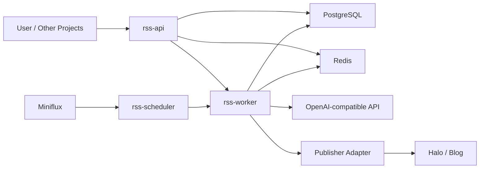

# RSS 智能日报平台设计说明

- 日期：2026-04-10
- 设计主题：基于 Miniflux + OpenAI Compatible API + Eino 的 RSS 翻译、分析、汇总与自动发布平台
- 工作区：`D:\Works\guaidongxi\RSS`
- 当前定位：单租户、个人自用、平台优先、Docker Compose 优先部署

## 1. 项目目标

构建一个基于 Golang 的 RSS 智能处理平台，通过 Miniflux 聚合 RSS 订阅内容，在每天固定时间自动拉取新增文章，使用兼容 OpenAI 标准格式的模型 API 完成翻译与分析，最后聚合成日报并自动发布到自建 Halo 等博客站点。同时，平台应向其他项目开放文章级和日报级接口，并具备清晰、可扩展的 Agent / Workflow 编排能力。

## 2. 已确认的需求边界

### 2.1 核心业务闭环

每天早上 07:00 自动执行以下链路：

1. 调用 Miniflux API 拉取当天新增文章
2. 对每篇文章执行 AI 翻译与分析
3. 汇总全部处理结果生成日报
4. 将日报自动发布到博客站点
5. 通过开放 API 提供日报与单篇文章处理结果查询能力

### 2.2 关键约束

- 技术栈必须使用 **Golang**
- Agent 框架必须使用 **Eino**
- 模型接入方式必须兼容 **OpenAI 标准格式 API**
- 优先做 **平台化架构**，但当前使用场景为 **个人自用 / 单租户**
- 日报采用 **自动发布**，不经过人工审核
- 每日预计处理规模为 **30~100 篇文章**
- 部署方式优先采用 **Docker Compose**

### 2.3 已确认的配置重点

优先支持以下四类配置：

- **AI 处理规则**：模型、Prompt、温度、结构化输出 schema 等
- **日报生成规则**：日报结构、栏目、摘要长度、标题风格等
- **发布规则**：博客模板、标签、分类、发布目标等
- **接口输出规则**：字段、过滤、分页、响应结构、Webhook 模板等

### 2.4 输出策略

- 博客仅发布一篇 **每日汇总日报**
- 单篇文章的翻译、分析结果不直接发布为博客文章
- 但单篇文章处理结果必须通过 API 可查询

## 3. 总体架构方案

最终采用 **方案 C：混合式平台架构**。

### 3.1 核心原则

- 单仓库（Monorepo）
- 多进程角色（API / Worker / Scheduler）
- 统一数据库与任务队列
- Eino **Workflow 主导主流程**
- Eino **Agent 负责局部策略增强**
- 对外提供开放 API 与可扩展发布器生态

### 3.2 服务划分

#### `rss-api`
负责：

- 对外 REST API
- 配置管理
- 查询文章处理结果
- 查询日报与发布记录
- 对其他项目开放兼容接口

#### `rss-worker`
负责：

- 执行翻译、分析、日报生成、发布等核心业务流程
- 运行 Eino Workflow
- 调用 LLM、发布器与相关适配器
- 承担失败重试、幂等与任务状态推进

#### `rss-scheduler`
负责：

- 每天 07:00 触发一次日报任务
- 保证指定时间窗口内任务幂等
- 不承载复杂业务逻辑

#### 基础设施

- **PostgreSQL**：存储文章、翻译、分析、日报、发布记录、配置、任务状态
- **Redis**：任务队列、幂等键、分布式锁、缓存
- **Miniflux**：RSS 内容聚合源
- **OpenAI-compatible API**：模型调用入口
- **Halo / Blog**：日报发布目标

### 3.3 逻辑结构



### 3.4 选择理由

该方案兼顾以下几点：

- 满足平台化演进空间
- 不引入过重的微服务治理成本
- 对个人自用场景足够轻量
- 适合 Docker Compose 部署
- 为开放 API、发布器扩展、Agent/Workflow 分层留出清晰边界

## 4. 数据模型与配置中心设计

### 4.1 设计原则

- 原始文章与 AI 派生结果分离
- 单篇文章处理结果可版本化
- 日报是聚合产物，不与单篇文章强耦合
- 配置驱动平台行为
- 发布结果独立建模

### 4.2 核心实体

#### `source_article`
用于保存从 Miniflux 拉取的原始文章，建议字段包括：

- `id`
- `miniflux_entry_id`
- `feed_id`
- `feed_title`
- `title`
- `author`
- `url`
- `content_html`
- `content_text`
- `published_at`
- `fetched_at`
- `fingerprint`
- `language`
- `metadata_json`

#### `article_processing_run`
表示文章的一次 AI 处理记录，建议字段包括：

- `id`
- `article_id`
- `pipeline_version`
- `model_provider`
- `model_name`
- `prompt_profile_id`
- `status`
- `started_at`
- `finished_at`
- `error_message`
- `token_usage_input`
- `token_usage_output`
- `latency_ms`

#### `article_translation`
表示翻译结果，建议字段包括：

- `id`
- `processing_run_id`
- `target_language`
- `title_translated`
- `summary_translated`
- `content_translated`
- `translation_style`
- `quality_notes`
- `structured_json`

#### `article_analysis`
表示分析结果，建议字段包括：

- `id`
- `processing_run_id`
- `core_summary`
- `key_points_json`
- `tags_json`
- `topic_category`
- `sentiment`
- `importance_score`
- `actionability_score`
- `risk_flags_json`
- `insights_markdown`
- `structured_json`

#### `daily_digest`
表示日报对象，建议字段包括：

- `id`
- `digest_date`
- `title`
- `subtitle`
- `status`
- `generation_config_id`
- `source_article_count`
- `included_article_count`
- `content_markdown`
- `content_html`
- `structured_json`
- `generated_at`

#### `daily_digest_item`
表示日报与文章的关联，建议字段包括：

- `id`
- `digest_id`
- `article_id`
- `processing_run_id`
- `section_name`
- `position`
- `include_reason`
- `render_snippet`

#### `publish_record`
表示一次发布行为，建议字段包括：

- `id`
- `target_type`
- `target_name`
- `digest_id`
- `request_payload_json`
- `response_payload_json`
- `remote_post_id`
- `remote_url`
- `status`
- `published_at`
- `error_message`

### 4.3 配置中心方案

采用 **配置实体 + 生效版本 + 当前激活指针** 模式。每次变更生成新的配置版本，运行记录中保存使用的版本信息，从而支持追溯与回滚。

#### `ai_profile`
负责模型接入与文章处理配置，例如：

- `provider_type`
- `base_url`
- `model_name`
- `api_key_ref`
- `temperature`
- `max_tokens`
- `timeout_seconds`
- `retry_policy_json`
- `translation_prompt_template`
- `analysis_prompt_template`
- `structured_output_schema_json`
- `version`
- `is_active`

#### `digest_profile`
负责日报生成规则，例如：

- `title_template`
- `subtitle_template`
- `section_strategy`
- `article_selection_rule_json`
- `summary_style`
- `max_items`
- `layout_template`
- `output_format`
- `version`
- `is_active`

#### `publish_profile`
负责发布规则，例如：

- `publisher_type`
- `endpoint`
- `auth_config_ref`
- `blog_template`
- `default_tags_json`
- `default_categories_json`
- `slug_strategy`
- `publish_status`
- `schedule_policy`
- `version`
- `is_active`

#### `api_profile`
负责接口输出规则，例如：

- `default_page_size`
- `max_page_size`
- `field_visibility_json`
- `filter_capabilities_json`
- `webhook_template_json`
- `response_schema_version`
- `version`
- `is_active`

## 5. Agent / Workflow 设计

### 5.1 核心原则

- **主链路使用 Workflow**
- **局部策略判断使用 Agent**
- 系统状态推进、幂等、重试与发布动作必须由确定性代码控制

### 5.2 每日主链路

定义每日任务 `daily-digest-job`，流程如下：

1. Scheduler 在 07:00 触发任务
2. 创建任务运行记录
3. 拉取 Miniflux 当日新增文章
4. 标准化、去重、过滤、入库
5. 为每篇文章创建 AI 处理任务
6. 并行执行翻译与分析
7. 汇总结果，交由 Agent 规划日报结构
8. 生成日报 Markdown / HTML
9. 调用发布器发布到博客
10. 保存任务总结与发布记录

### 5.3 Workflow 分层

#### 采集层
负责文章拉取、标准化、去重、入库。纯确定性逻辑。

#### 单篇处理层
负责单篇文章清洗、翻译、分析、结构化校验、结果落库。使用 Eino 组件，但保持受控。

#### 聚合编排层
负责挑选日报候选、决定日报栏目结构、整理重点内容、形成日报大纲与正文。这里引入 Agent。

#### 发布层
负责最终渲染、调用发布器、保存发布结果。纯确定性逻辑。

### 5.4 单篇文章处理工作流

建议定义标准子流程：

1. 加载原始文章
2. 内容清洗
3. 语言检测与标准化
4. 执行翻译任务
5. 执行分析任务
6. 校验结构化输出
7. 保存翻译结果
8. 保存分析结果
9. 更新处理状态

### 5.5 Agent 设计

#### `DigestPlanningAgent`
作用：

- 对当天分析结果做编排决策
- 决定日报栏目结构
- 进行重点文章排序
- 输出日报大纲与入选理由

输入：

- 当天全部 `article_analysis`
- 当前 `digest_profile`
- 可选的历史日报摘要

输出：

- 标题建议
- 栏目列表
- 每个栏目的文章集合
- 汇总角度建议
- 入选理由

#### `TitleToneAgent`
作用：

- 优化日报标题、副标题与导语
- 适配博客整体表达风格

输入：

- 日报结构化草稿
- 标题模板
- 风格配置

输出：

- `title`
- `subtitle`
- `opening_note`

#### `FallbackStrategyAgent`（第二阶段可选）
作用：

- 在文章分析失败较多、分类异常或数量不足时给出回退策略

### 5.6 Eino 代码组织建议

#### Workflow

- `DailyDigestWorkflow`
- `ArticleProcessingWorkflow`
- `PublishingWorkflow`

#### Agent

- `DigestPlanningAgent`
- `TitleToneAgent`

#### Tool

Agent 只通过 Tool 获取上下文和执行受限动作，例如：

- `ListCandidateArticlesTool`
- `LoadDigestProfileTool`
- `GetRecentDigestContextTool`
- `RenderDigestDraftTool`
- `ValidateDigestStructureTool`

### 5.7 并发、失败与幂等

#### 并发策略

- 单篇文章处理并发执行
- 并发度可配置，如 `5 / 10 / 20`
- 对模型调用做限流
- 尽量按文章粒度重试，而不是整批重跑

#### 失败处理

- 文章级失败：单篇重试，达到上限后标记失败，不阻塞整批日报
- 日报级失败：保留上下文，允许从聚合阶段重跑
- 发布级失败：日报本体保留，发布动作单独可重试

#### 幂等控制

- 文章入库幂等：基于 `miniflux_entry_id` 或内容指纹
- 每日任务幂等：基于 `digest_date + profile_version`
- 发布幂等：基于 `digest_id + publish_profile_version + target_type`

#### 可观测性

至少记录：

- 每次任务开始/结束时间
- 每篇文章处理耗时
- 模型 token 使用量
- 成功/失败统计
- 发布耗时与响应码

## 6. 开放接口生态设计

### 6.1 设计原则

- 面向资源而非数据库表
- 查询接口与控制接口分离
- 结果经过平台标准化后再对外暴露
- 发布器采用适配器机制
- 通过 `api_profile` 配置接口输出行为

### 6.2 查询型 API

#### 文章相关

- `GET /api/v1/articles`
- `GET /api/v1/articles/{id}`
- `GET /api/v1/articles/{id}/translation`
- `GET /api/v1/articles/{id}/analysis`

#### 日报相关

- `GET /api/v1/digests`
- `GET /api/v1/digests/{id}`
- `GET /api/v1/digests/latest`
- `GET /api/v1/digests/{id}/items`

#### 发布记录

- `GET /api/v1/publishes`
- `GET /api/v1/publishes/{id}`

### 6.3 管理型 API

#### 配置管理

- `GET /api/v1/profiles/ai`
- `POST /api/v1/profiles/ai`
- `GET /api/v1/profiles/digest`
- `POST /api/v1/profiles/digest`
- `GET /api/v1/profiles/publish`
- `POST /api/v1/profiles/publish`
- `GET /api/v1/profiles/api`
- `POST /api/v1/profiles/api`

#### 任务控制

- `POST /api/v1/jobs/daily-digest/run`
- `POST /api/v1/jobs/articles/{id}/reprocess`
- `POST /api/v1/digests/{id}/republish`

#### 运行状态

- `GET /api/v1/jobs`
- `GET /api/v1/jobs/{id}`
- `GET /api/v1/metrics/overview`

### 6.4 集成型 API

#### Pull 模式

- `GET /api/v1/public/digest/latest`
- `GET /api/v1/public/articles/recent`

#### Push 模式

通过 Webhook 推送事件：

- `digest.generated`
- `digest.published`
- `article.processed`

#### 导出能力

- `GET /api/v1/exports/digest/{id}.md`
- `GET /api/v1/exports/digest/{id}.html`
- `GET /api/v1/exports/digest/{id}.json`

### 6.5 文章与日报资源模型

#### 文章资源

支持 `compact` 与 `full` 视图：

- `compact`：列表页所需基础字段
- `full`：附带 translation、analysis、processing 等详情

#### 日报资源

应包括：

- 基础信息
- 内容正文（Markdown / HTML）
- 栏目结构
- 关联文章
- 发布状态与远端地址

### 6.6 发布器生态

定义统一发布器接口：

```go
type Publisher interface {
    Name() string
    PublishDigest(ctx context.Context, req PublishDigestRequest) (*PublishDigestResult, error)
    ValidateConfig(ctx context.Context, cfg PublishProfile) error
}
```

第一版至少支持：

- `HaloPublisher`
- `WebhookPublisher`
- `MarkdownExportPublisher`

### 6.7 鉴权与版本化

建议提供：

- `Admin API Key`：管理接口
- `Read API Key`：查询接口
- `Webhook Secret`：Webhook 验签

所有接口采用 `/api/v1/...` 版本化路径。

## 7. 技术架构与项目目录

### 7.1 技术选型

- **Golang**：主语言
- **Eino**：Workflow 与 Agent 编排
- **Gin**：HTTP API
- **GORM**：数据库访问主方案
- **PostgreSQL**：主数据库
- **Redis**：队列与缓存
- **Asynq**：任务队列
- **koanf**：配置加载
- **zap**：日志
- **Prometheus**：指标采集
- **goldmark**：Markdown 渲染
- **goquery**：HTML 清洗与提取

### 7.2 数据访问策略

采用 **GORM 为主，复杂查询保留 Raw SQL 逃生口**：

- 常规 CRUD、筛选、分页、排序使用 GORM
- 复杂聚合或高复杂度报表允许局部手写 SQL
- 事务使用 GORM `Transaction(...)`
- 分页、排序、预加载在 repository 层统一封装

### 7.3 GORM 使用约束

- 不让上层业务到处传递 `*gorm.DB`
- repository 层统一封装数据库细节
- 领域模型与持久化模型分离
- 正式环境使用显式 migration，不依赖 `AutoMigrate`
- 遇到复杂查询时不强行用 ORM 表达

### 7.4 推荐目录结构

```text
D:\Works\guaidongxi\RSS
├─ cmd/
│  ├─ rss-api/
│  │  └─ main.go
│  ├─ rss-worker/
│  │  └─ main.go
│  └─ rss-scheduler/
│     └─ main.go
│
├─ internal/
│  ├─ app/
│  │  ├─ api/
│  │  ├─ worker/
│  │  └─ scheduler/
│  ├─ domain/
│  │  ├─ article/
│  │  ├─ digest/
│  │  ├─ processing/
│  │  ├─ publish/
│  │  ├─ profile/
│  │  └─ job/
│  ├─ service/
│  ├─ repository/
│  │  ├─ postgres/
│  │  │  ├─ models/
│  │  │  ├─ article_repository.go
│  │  │  ├─ digest_repository.go
│  │  │  ├─ publish_repository.go
│  │  │  ├─ profile_repository.go
│  │  │  └─ job_repository.go
│  │  ├─ redis/
│  │  └─ interfaces.go
│  ├─ workflow/
│  │  ├─ daily_digest_workflow/
│  │  ├─ article_processing_workflow/
│  │  └─ publishing_workflow/
│  ├─ agent/
│  │  ├─ digest_planning/
│  │  ├─ title_tone/
│  │  └─ tools/
│  ├─ adapter/
│  │  ├─ miniflux/
│  │  ├─ llm/
│  │  ├─ publisher/
│  │  │  ├─ halo/
│  │  │  ├─ webhook/
│  │  │  └─ markdown_export/
│  │  └─ httpapi/
│  ├─ task/
│  │  ├─ asynq/
│  │  └─ payloads.go
│  ├─ config/
│  ├─ render/
│  ├─ schema/
│  └─ telemetry/
│
├─ api/
│  └─ openapi/
│     └─ openapi.yaml
├─ migrations/
├─ deployments/
│  ├─ docker/
│  └─ compose/
├─ configs/
│  ├─ config.example.yaml
│  └─ prompts/
├─ docs/
│  ├─ architecture/
│  └─ api/
└─ Makefile
```

### 7.5 Docker Compose 基础服务

第一版 Compose 建议包含：

- `rss-api`
- `rss-worker`
- `rss-scheduler`
- `postgres`
- `redis`

如有需要，可选托管：

- `miniflux`
- `miniflux-db`

### 7.6 配置分层

- **运行时基础配置**：环境变量 / YAML（数据库、Redis、端口、日志级别等）
- **业务配置**：数据库中的各类 Profile（AI、Digest、Publish、API）

### 7.7 Prompt 管理

- 默认 Prompt 模板存放在 `configs/prompts/`
- 激活版本与覆盖项保存在数据库 profile 中
- 运行记录中写入使用的 Prompt 版本与配置版本

### 7.8 OpenAPI

维护 `api/openapi/openapi.yaml` 作为对外接口契约，便于其他项目接入与生成 SDK。

## 8. MVP 范围与迭代计划

### 8.1 MVP 定义

MVP 以“跑通完整业务闭环”为目标：

- 每天 07:00 自动从 Miniflux 拉取新增文章
- 完成翻译与分析
- 生成一篇日报
- 自动发布到博客
- 提供日报与文章处理结果查询 API

### 8.2 MVP 必做范围

#### 基础运行骨架

- `rss-api`
- `rss-worker`
- `rss-scheduler`
- PostgreSQL
- Redis
- Docker Compose 一键启动

#### 主链路能力

- 定时调度
- Miniflux 拉取
- 入库与去重
- 单篇翻译与分析
- 日报生成
- Halo 发布

#### 核心配置能力

- `ai_profile`
- `digest_profile`
- `publish_profile`
- `api_profile`

#### 开放接口

- 文章列表/详情
- 翻译结果
- 分析结果
- 日报列表/详情/最新日报
- 发布记录查询

#### 工作流能力

- `DailyDigestWorkflow`
- `ArticleProcessingWorkflow`
- `DigestPlanningAgent`
- 基本重试与幂等控制

### 8.3 暂不做的范围

第一版先不做：

- 多租户
- 完整权限系统
- 复杂管理后台 UI
- 多博客目标同时发布
- 高级多 Agent 协作
- RAG / 向量检索
- 用户级 Prompt 可视化编辑器
- 实时通知中心

### 8.4 阶段划分

#### 阶段 1：跑通闭环

交付：

- Compose 部署
- 基础模型与仓储层
- Miniflux 接入
- OpenAI-compatible 接入
- 翻译/分析流程
- 日报生成
- Halo 发布器
- 基础 API

#### 阶段 2：做稳系统

交付：

- 更完善的任务状态机
- 失败重试与补偿
- 指标与日志
- Prompt / Profile 版本追踪
- 发布重试
- 输出校验增强

#### 阶段 3：扩展生态

交付：

- Webhook
- 更多发布器
- 轻量管理界面
- 导出格式扩展
- 外部项目接入示例
- 更完整的 OpenAPI 契约

### 8.5 推荐里程碑

1. 项目骨架与部署基础
2. 文章采集与存储
3. 单篇 AI 处理
4. 日报生成与发布
5. 稳定性与观测增强

## 9. 风险与控制策略

### 风险 1：LLM 输出不稳定

应对：

- 强制结构化 schema
- 输出校验与修复层
- 单篇失败重试
- 控制 Prompt 复杂度

### 风险 2：RSS 原文质量不稳定

应对：

- 保留原始 HTML
- 引入清洗与纯文本提取层
- 做内容长度与质量阈值检查
- 允许跳过低质量文章但保留记录

### 风险 3：模型调用限流与成本上涨

应对：

- 控制并发
- 限制单篇输入长度
- 摘要优先于全文翻译
- 统计 token usage

### 风险 4：日报质量波动

应对：

- Agent 只负责规划，不控制系统状态
- 使用结构化分析结果作为聚合输入
- 通过 Digest Profile 持续调整栏目与选择规则
- 保存每篇文章的入选理由

### 风险 5：博客发布集成存在不确定性

应对：

- 抽象统一 `Publisher`
- 将 Halo 作为 Adapter 实现
- 保留 `MarkdownExportPublisher` 作为兜底方向
- 发布失败不影响日报本体保存

### 风险 6：GORM 查询逐渐复杂

应对：

- repository 层统一收口
- 复杂场景使用 Raw SQL
- 严禁 GORM 直接渗透到 service/workflow 层

## 10. 最终结论

本项目被定义为：

> 一个基于 Go + Eino + GORM + Docker Compose 的单租户平台化 RSS 智能处理系统。
>
> 它从 Miniflux 拉取文章，执行翻译与分析，生成日报并自动发布到博客，同时通过开放 API 提供文章级与日报级数据服务。

该设计优先保证：

- 主业务闭环可运行
- 平台边界清晰
- Agent 能力可控
- 接口生态可扩展
- 后续演进空间充足

