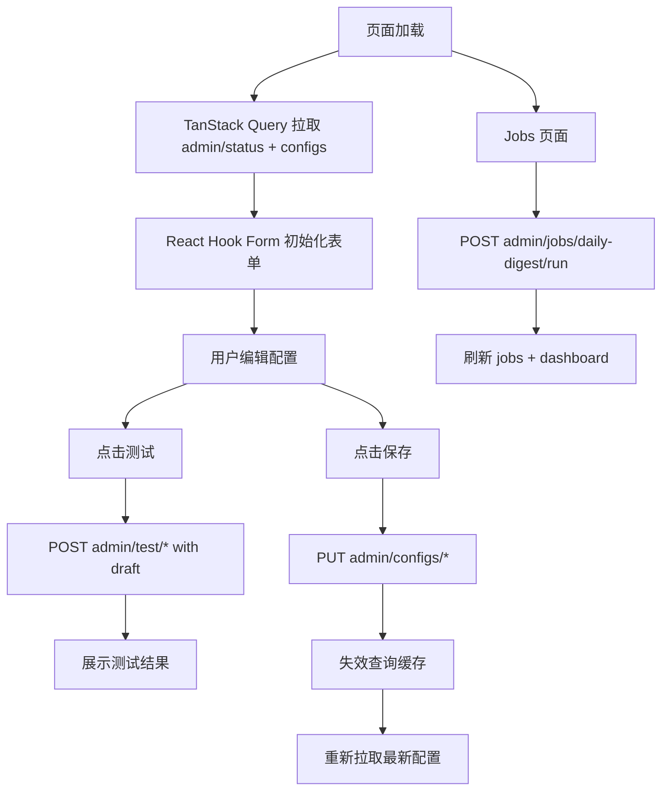

# FluxDigest Web UI 设计说明

- 日期：2026-04-11
- 设计主题：FluxDigest 配置控制台型 Web UI（React）
- 工作区：`D:\Works\guaidongxi\RSS\.worktrees\rss-ai-digest-platform-mvp`
- 当前定位：单用户、个人自用、配置控制台优先、服务于现有 Go 后端 MVP

## 1. 设计目标

为 FluxDigest 增加一套基于 React 的 Web UI，优先解决“可视化配置与运行控制”问题，而不是做内容消费站点或博客前台。第一阶段重点围绕以下能力展开：

1. 可视化管理 LLM、Miniflux、Prompt、发布器、调度等核心配置
2. 提供测试连接、手动触发日报、查看最近任务状态等运维入口
3. 与现有后端 API / Worker / Scheduler 架构对接，不改动当前平台分层
4. 为后续平台化扩展保留统一配置中心和 Admin API 边界

## 2. 已确认的需求边界

### 2.1 产品定位

- Web UI 是 **FluxDigest 的配置控制台**
- 优先服务 **个人自用 / 单用户** 场景
- 不承担博客前台展示职责
- 不负责 RSS 订阅管理本身，RSS 订阅源仍由 **Miniflux** 管理

### 2.2 第一阶段目标

第一阶段需要支持：

- Dashboard 总览
- LLM 配置
- Miniflux 配置
- Prompt 配置
- Publish 配置
- Job / Scheduler 管理
- 测试连接
- 手动触发日报
- 查看最近任务状态与结果摘要

### 2.3 第一阶段不做

以下内容明确不纳入当前实现范围：

- 多用户与权限系统
- Prompt 历史版本树 / 回滚系统
- 拖拽式 Agent / Workflow 可视化编排器
- 内容消费型文章列表站点
- 复杂审计日志中心
- 多发布目标编排与分发策略中心

## 3. 总体方案选择

最终采用：**方案 A：配置控制台优先**。

### 3.1 选择原因

该方案最符合当前项目阶段和使用方式：

- 现阶段最核心的痛点是配置复杂、测试链路分散、运维入口不足
- 用户是个人自用，先把“能可靠配置、能手动验证、能看状态”做好，收益最大
- 现有后端已经具备文章接口、日报接口与任务触发接口，Web UI 无需先做内容站
- 未来若要扩展内容浏览、Prompt 版本管理、可视化工作流，也能在当前控制台基础上继续演进

## 4. 前端技术方案

推荐技术栈如下：

- **React**：UI 基础框架
- **Vite**：构建与本地开发
- **TypeScript**：类型约束
- **React Router**：路由管理
- **Ant Design**：后台控制台组件库
- **TanStack Query**：服务端状态获取、缓存、失效与刷新
- **React Hook Form**：复杂表单状态管理
- **Zod**：表单与接口数据校验

### 4.1 不选择 Next.js 的原因

当前 Web UI 本质是内控后台，主要工作是配置编辑、状态展示、测试请求和任务操作，不依赖 SSR / SEO / 文件路由收益。使用 React + Vite 更轻、更直接，也更适合快速落地控制台。

## 5. 信息架构与页面规划

第一阶段采用单页应用（SPA）结构，主要页面如下：

1. `/dashboard`
2. `/configs/llm`
3. `/configs/miniflux`
4. `/configs/prompts`
5. `/configs/publish`
6. `/jobs`

### 5.1 全局布局

建议布局：

- 左侧导航：Dashboard / Configs / Jobs
- 顶部栏：系统状态摘要、最近任务提示、手动刷新
- 主内容区：页面主体
- 全局反馈：Toast / Message / Modal / Drawer

### 5.2 目录结构建议

```txt
web/
  src/
    app/
      router/
      providers/
      layout/
    pages/
      dashboard/
      configs/
        llm/
        miniflux/
        prompts/
        publish/
      jobs/
    components/
      common/
      forms/
      status/
      jobs/
    features/
      config/
      job/
      status/
    services/
      api/
      queries/
      mutations/
    hooks/
    utils/
    types/
    styles/
  public/
```

## 6. 页面职责与组件拆分

### 6.1 `/dashboard`

目标：展示系统整体状态与快捷操作。

建议组件：

- `SystemStatusCards`
- `TodayDigestCard`
- `LatestJobRunCard`
- `QuickActionsCard`
- `RecentJobsTable`
- `ActiveProfileSummary`

主要展示内容：

- API / DB / Redis 状态
- LLM / Miniflux / Publisher 配置与最近测试状态
- 最新日报日期、状态、发布时间
- 最近一次任务执行情况
- 手动触发日报、测试外部集成等快捷操作

### 6.2 `/configs/llm`

目标：管理模型接入与调用策略。

建议组件：

- `LlmProviderFormCard`
- `ModelOptionsCard`
- `ConcurrencyPolicyCard`
- `SecretInput`
- `ConnectionTestPanel`
- `SaveBar`

### 6.3 `/configs/miniflux`

目标：配置 Miniflux 连接与拉取规则。

建议组件：

- `MinifluxConnectionCard`
- `FeedSelectionCard`
- `IngestionRulesCard`
- `MinifluxTestPanel`
- `SaveBar`

设计要求：

- 连接测试成功后再拉取分类与 Feed 列表
- 用户优先通过勾选分类 / Feed 的方式完成选择
- 空选择表示使用全部订阅源

### 6.4 `/configs/prompts`

目标：配置翻译、分析、日报生成 Prompt。

建议组件：

- `PromptProfileHeader`
- `TranslationPromptEditor`
- `AnalysisPromptEditor`
- `DigestPromptEditor`
- `PromptVariablesDrawer`
- `PromptTestPanel`
- `SaveBar`

### 6.5 `/configs/publish`

目标：配置日报发布目标与渲染规则。

建议组件：

- `PublisherSelectorCard`
- `PublisherCommonConfigCard`
- `PublisherDynamicFieldsCard`
- `RenderRulesCard`
- `PublishTestPanel`
- `SaveBar`

设计要求：

- 公共字段固定建模
- 平台差异字段通过 `adapter_schema` 动态渲染
- 第一阶段优先支持 Holo，但接口要允许未来接入其他发布器

### 6.6 `/jobs`

目标：管理调度与查看任务历史。

建议组件：

- `SchedulerConfigCard`
- `ManualRunCard`
- `JobHistoryFilters`
- `JobRunsTable`
- `JobRunDetailDrawer`

## 7. 配置字段设计

### 7.1 LLM 配置字段

建议字段：

- `provider_name`
- `base_url`
- `api_key`
- `model`
- `temperature`
- `top_p`
- `max_tokens`
- `timeout_ms`
- `structured_output_enabled`
- `request_concurrency`
- `rpm_limit`
- `is_enabled`

约束：

- `api_key` 不回显真实值
- 页面只展示“已设置 / 未设置”与掩码
- 前端不将密钥写入 localStorage

### 7.2 Miniflux 配置字段

建议字段：

- `base_url`
- `api_token`
- `category_ids`
- `feed_ids`
- `fetch_limit`
- `include_read`
- `lookback_hours`
- `dedupe_by_url`
- `dedupe_by_fingerprint`
- `is_enabled`

### 7.3 Prompt 配置字段

建议字段：

- `profile_name`
- `target_language`
- `translation_prompt`
- `analysis_prompt`
- `digest_prompt`
- `prompt_version`
- `schema_version`
- `is_enabled`

约束：

- 第一阶段仅维护“当前生效配置”
- 不做版本树与回滚面板

### 7.4 Publish 配置字段

公共字段建议：

- `target_type`
- `endpoint`
- `auth_token`
- `publish_status`
- `title_template`
- `slug_template`
- `default_tags`
- `default_category`
- `content_format`
- `append_source_links`
- `is_enabled`

扩展字段：

- `adapter_config`
- `adapter_schema`

### 7.5 Scheduler / Jobs 配置字段

建议字段：

- `schedule_enabled`
- `schedule_time`
- `timezone`
- `manual_digest_date`
- `job_type`
- `status`
- `date_range`

约束：

- 默认时区为 `Asia/Shanghai`
- 默认执行时间为每天 `07:00`
- 手动触发允许指定 `digest_date`
- 同日重复触发仍遵守后端幂等语义，返回 `skipped`

## 8. Admin API 契约草案

Web UI 第一阶段通过新增 Admin API 与后端对接，建议接口如下：

- `GET /api/v1/admin/status`
- `GET /api/v1/admin/configs`
- `PUT /api/v1/admin/configs/llm`
- `PUT /api/v1/admin/configs/miniflux`
- `PUT /api/v1/admin/configs/prompts`
- `PUT /api/v1/admin/configs/publish`
- `PUT /api/v1/admin/configs/scheduler`
- `POST /api/v1/admin/test/llm`
- `POST /api/v1/admin/test/miniflux`
- `POST /api/v1/admin/test/publish`
- `POST /api/v1/admin/jobs/daily-digest/run`
- `GET /api/v1/admin/jobs`
- `GET /api/v1/admin/jobs/:job_id`

### 8.1 接口风格

- 与现有后端风格保持一致，统一使用 **snake_case**
- 返回结构优先稳定、易扩展，避免前端依赖过深的嵌套细节

### 8.2 `GET /api/v1/admin/status`

用于 Dashboard 初始化。

示例：

```json
{
  "system": {
    "api": "ok",
    "db": "ok",
    "redis": "ok"
  },
  "integrations": {
    "llm": {
      "configured": true,
      "last_test_status": "ok",
      "last_test_at": "2026-04-11T18:00:00+08:00"
    },
    "miniflux": {
      "configured": true,
      "last_test_status": "ok"
    },
    "publisher": {
      "configured": true,
      "last_test_status": "unknown"
    }
  },
  "runtime": {
    "latest_digest_date": "2026-04-11",
    "latest_digest_status": "published",
    "latest_job_status": "succeeded"
  }
}
```

### 8.3 `GET /api/v1/admin/configs`

用于一次性加载各类配置快照：

```json
{
  "llm": {},
  "miniflux": {},
  "prompts": {},
  "publish": {},
  "scheduler": {}
}
```

### 8.4 Secret 字段协议

敏感字段统一采用显式协议，避免“空字符串到底是保留还是清空”的歧义。

查询返回建议：

```json
{
  "api_key": {
    "is_set": true,
    "masked_value": "sk-****"
  }
}
```

更新提交建议：

```json
{
  "api_key": {
    "mode": "keep"
  }
}
```

或：

```json
{
  "api_key": {
    "mode": "replace",
    "value": "sk-xxxx"
  }
}
```

或：

```json
{
  "api_key": {
    "mode": "clear"
  }
}
```

### 8.5 测试接口约束

测试接口允许直接使用前端当前草稿数据，不要求先保存再测试。

示例：

```json
{
  "draft": {
    "base_url": "https://example.com/v1",
    "model": "gpt-4.1-mini"
  }
}
```

返回建议包含：

- `status`
- `message`
- `latency_ms`
- 必要时附带少量诊断字段

### 8.6 手动任务触发接口

`POST /api/v1/admin/jobs/daily-digest/run`

请求示例：

```json
{
  "digest_date": "2026-04-11"
}
```

返回可能为：

```json
{
  "status": "accepted",
  "digest_date": "2026-04-11"
}
```

或：

```json
{
  "status": "skipped",
  "digest_date": "2026-04-11"
}
```

## 9. 页面交互与状态设计

### 9.1 保存策略

采用 **每页独立保存**，不提供全局 `Save All`。

原因：

- 配置类型差异明显
- 风险边界更清晰
- 用户更容易理解当前修改影响范围

### 9.2 Dirty State

每个配置页应明确体现：

- 是否存在未保存变更
- 离开页面时是否需要确认
- 保存成功后的状态反馈

### 9.3 测试与保存分离

配置页统一保留两类操作：

- `测试连接` / `测试配置`
- `保存配置`

不将测试和保存合并为单个按钮。

### 9.4 Secret 字段交互

密钥字段统一遵循：

- 默认只展示“已设置 / 未设置”
- 用户可选择保留、替换、清空
- 不显示真实值
- 不缓存到浏览器持久存储

### 9.5 长任务反馈

手动触发日报后：

1. 立即展示 `accepted` / `skipped` 结果
2. Toast 提示用户当前状态
3. 自动刷新 Dashboard 与 Jobs 列表
4. 支持在 `JobRunDetailDrawer` 中查看任务详情

## 10. 数据流设计



## 11. 安全与部署约束

由于 Web UI 要管理 `api_key`、`token` 等敏感配置，第一阶段不单独实现完整登录系统，但部署必须满足以下至少一种约束：

- 仅暴露在内网
- 放在反向代理 Basic Auth 后面
- 放在现有网关鉴权后面

设计结论：

> FluxDigest Web UI v1 是“单用户内控后台”，不是“公网开放后台”。

## 12. 前后端职责边界

### 12.1 前端负责

- 展示配置与运行状态
- 编辑并提交配置草稿
- 调用测试接口与任务接口
- 提供清晰的交互反馈

### 12.2 后端负责

- 持久化配置
- 安全处理密钥字段
- 执行连接测试
- 执行任务触发与任务查询
- 汇总 Dashboard 所需运行状态

## 13. 第一阶段验收标准

满足以下条件即可认为第一阶段 Web UI 设计目标达成：

1. 用户可通过 Web UI 完成 LLM、Miniflux、Prompt、Publish、Scheduler 的配置编辑
2. 敏感字段不会被前端明文回显或持久化缓存
3. 用户可直接测试 LLM / Miniflux / Publish 配置
4. 用户可手动触发某天日报任务，并看到 `accepted` / `skipped` 结果
5. Dashboard 可展示系统状态、最近任务和今日日报摘要
6. Jobs 页面可查看最近任务历史与单次任务详情
7. 后端 Admin API 与前端字段协议稳定，便于后续继续扩展

## 14. 后续实现顺序建议

建议按以下顺序进入实现：

1. 先补后端 Admin API 与配置读写模型
2. 再搭建 React Web UI 骨架、路由、全局布局
3. 优先实现 Dashboard + LLM 配置页 + Miniflux 配置页
4. 然后实现 Prompts / Publish / Jobs 页面
5. 最后补充联调、错误态与体验细节

这样能尽早打通最关键的“配置读取 -> 编辑 -> 测试 -> 保存 -> 触发任务”闭环。
