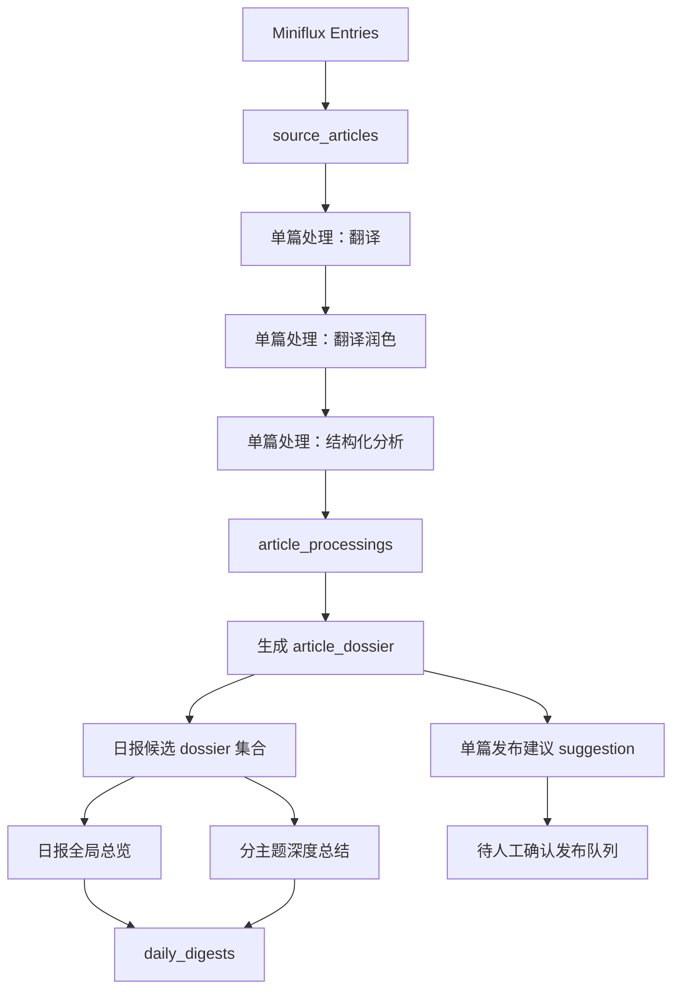

# FluxDigest 内容资产流水线升级设计说明

- 日期：2026-04-12
- 设计主题：FluxDigest 阶段 A —— 从“按天生成日报”升级为“先沉淀单篇内容资产，再汇总生成日报”
- 工作区：`D:\Works\guaidongxi\RSS`
- 当前定位：个人自用、单租户、平台优先、现有 Go Monorepo 基础上渐进升级

## 1. 设计目标

阶段 A 的目标不是继续在现有日报链路上堆字段，而是把 FluxDigest 升级成一个以“单篇内容资产”为核心的系统：

1. 每篇文章先完成翻译、翻译润色、结构化分析与 dossier 生成
2. dossier 同时保存机器可用的卡片层与人可读的长文层
3. 日报不再直接吃原始文章，而是消费 dossier 做更详细的全局总结
4. 单篇文章默认不自动发布，只生成“建议发布”并等待人工确认
5. 为后续 Prompt 配置 WebUI、手动重跑、发布通道扩展和部署标准化打好边界

一句话定义本阶段：

> FluxDigest 阶段 A 要把系统从“日报生成脚本”升级为“内容资产平台雏形”。

## 2. 已确认的业务约束

### 2.1 用户已确认的核心选择

- 单篇文章发布策略：**自动初筛 + 人工确认**
- 单篇内容结构：**卡片层 + 长文层双层保存**
- 日报汇总输入：**消费单篇 dossier，不直接消费原文**
- 日报正文风格：**全局总览 + 分主题深度展开 + 单篇推荐阅读**
- 日报覆盖范围：**重点文章深写 + 其他文章简表**
- 单篇 dossier 结构：**结构化字段 + 长文本分析双层**
- Prompt 变更策略：**版本化保存，不自动全量重算，支持手动重跑**
- 发布通道策略：**共用通道池，但日报与单篇分别配置规则**

### 2.2 当前系统现状

当前代码主链路是：

1. 从 Miniflux 拉取当日文章
2. 对单篇文章执行翻译与分析
3. 聚合生成日报
4. 发布日报

当前限制包括：

- `source_articles` 是原始事实层，职责清晰
- `article_processings` 目前同时承担“翻译结果 + 分析结果”的最新处理输出
- `daily_digests` 保存最终日报
- 单篇文章还没有独立的 dossier 资产模型
- 单篇文章没有独立发布建议与发布状态
- Prompt 配置目前只有 LLM 配置化，`translation / analysis / digest` prompt 还未真正变成运行时可编辑资产

结论：

> 阶段 A 不能只改日报 prompt，必须先建立“单篇内容资产层”。

## 3. 方案对比与推荐

### 3.1 方案一：继续扩展 `article_processings`

在现有 `article_processings` 上继续加字段，保存：

- 翻译润色全文
- 详细分析
- 单篇发布建议
- 版本信息
- 长文导出内容

优点：

- 改动少
- 迁移成本低

缺点：

- 一张表承担过多职责
- 单篇资产、处理版本、发布状态、日报引用混在一起
- 后续做重跑、版本追踪、规则审核时会快速变乱

### 3.2 方案二：新增“单篇资产层 + 日报汇总层”

保留现有原始文章与处理中间层，在其上增加 dossier 资产层：

- `source_articles`：原始事实
- `article_processings`：中间 AI 处理版本
- `article_dossiers`：单篇最终资产
- `daily_digests`：基于 dossier 的日报聚合结果

优点：

- 单篇与日报彻底解耦
- 最适合单篇保存、单篇可发布、日报更详细的目标
- 版本化、重跑、接口扩展更自然

缺点：

- 比方案一多一轮数据建模和迁移工作

### 3.3 方案三：完整多阶段异步流水线

把流程拆成多个独立任务：

- ingestion
- translation
- polishing
- dossier generation
- article publish suggestion
- digest aggregation
- article publish execution

优点：

- 扩展性和观测性最好
- 结构最完整

缺点：

- 对当前个人自用阶段过重
- 会把本阶段做成“平台重构”而不是“可落地升级”

### 3.4 推荐方案

采用 **方案二**，并在代码组织上为方案三预留演进边界：

> 先建立“单篇 dossier 资产层”，让日报消费 dossier；任务编排继续以现有 worker 主链路为主，不在阶段 A 一次拆成过细异步流水线。

## 4. 总体架构升级

### 4.1 新链路概览

### 4.2 核心原则

- 原始文章、处理中间层、单篇资产层、日报聚合层明确分离
- 日报生成消费 dossier，而不是原始文章或低信息密度的轻摘要
- 单篇文章默认先保存，再由建议发布机制进入人工确认队列
- Prompt、LLM profile、运行版本都进入可追踪元数据
- WebUI、API、发布器都围绕“资源化对象”构建，而不是围绕某个任务内部结构构建

## 5. 数据模型设计

### 5.1 保留的现有模型

#### `source_articles`

保持为原始事实层，职责不变：

- Miniflux 文章唯一来源
- 原始标题、作者、正文、链接、来源 feed
- 去重与追溯依据

#### `daily_digests`

继续保存最终日报，但生成输入改为 dossier 集合，而不是原始文章集合。

### 5.2 调整职责的现有模型

#### `article_processings`

调整后职责：

- 保存某篇文章一次 AI 处理中间版本快照
- 记录翻译、分析与基础质量结果
- 支持后续生成 dossier

建议补充字段：

- `processing_version`
- `translation_prompt_version`
- `analysis_prompt_version`
- `llm_profile_version`
- `status`
- `error_message`
- `processed_at`

该表不再承担最终对外单篇展示资产的职责。

### 5.3 新增核心模型：`article_dossiers`

`article_dossiers` 是阶段 A 的关键新增表，代表“单篇最终资产”。

建议字段分为五组。

#### 基础关联

- `id`
- `article_id`
- `processing_id`
- `digest_date`
- `version`
- `is_active`

#### 卡片层字段

- `title_translated`
- `summary_polished`
- `core_summary`
- `key_points_json`
- `topic_category`
- `importance_score`
- `recommendation_reason`
- `reading_value`
- `priority_level`

#### 长文层字段

- `content_polished_markdown`
- `analysis_longform_markdown`
- `background_context`
- `impact_analysis`
- `debate_points`
- `target_audience`

#### 发布建议字段

- `publish_suggestion`
- `suggestion_reason`
- `suggested_channels_json`
- `suggested_tags_json`
- `suggested_categories_json`

#### 版本与追踪字段

- `translation_prompt_version`
- `analysis_prompt_version`
- `dossier_prompt_version`
- `llm_profile_version`
- `created_at`
- `updated_at`

### 5.4 新增发布状态模型：`article_publish_states`

建议增加单篇发布状态表，专门描述单篇内容从建议到发布的生命周期。

建议字段：

- `id`
- `dossier_id`
- `state`
- `approved_by`
- `decision_note`
- `publish_channel`
- `remote_id`
- `remote_url`
- `error_message`
- `published_at`
- `updated_at`

状态建议为：

- `draft`
- `suggested`
- `approved`
- `ignored`
- `publishing`
- `published`
- `failed`

### 5.5 日报与 dossier 关联

建议增加关联表 `daily_digest_items`（若现有实现未显式建模则补建），以支持：

- 哪些 dossier 被选入日报
- 哪些是重点文章
- 哪些是“其他值得关注”
- 主题分组与排序顺序

建议字段：

- `id`
- `digest_id`
- `dossier_id`
- `section_name`
- `importance_bucket`
- `position`
- `is_featured`

## 6. 单篇处理链路设计

### 6.1 单篇处理新流程

每篇文章进入以下顺序：

1. 原文清洗
2. 标题与摘要翻译
3. 全文翻译
4. 翻译润色
5. 结构化分析
6. 生成 dossier
7. 生成单篇发布建议
8. 保存 processing 与 dossier

### 6.2 dossier 输出结构

阶段 A 统一要求 dossier 产出“双层结构”：

#### 机器可用层

给 API、规则引擎、日报汇总使用：

- 重要度
- 分类
- 推荐理由
- 推荐阅读价值
- 关键点
- 是否建议发布

#### 人可读层

给单篇详情与单篇发布正文使用：

- 润色后正文
- 详细分析
- 背景与上下文
- 影响判断
- 争议点
- 适合谁阅读

### 6.3 单篇发布建议策略

系统不直接自动发布单篇，而是先给出建议：

- `suggested`
- `hold`
- `ignore`

建议判断输入来自 dossier 的结构化字段，例如：

- `importance_score`
- `topic_category`
- `recommendation_reason`
- `reading_value`
- 主题白名单
- 关键词黑名单

建议判断结果写入 `article_publish_states`。

## 7. 日报生成链路设计

### 7.1 日报输入

日报输入不再是原始文章或轻量 processing 结果，而是：

- 当天所有 active dossier
- digest prompt 当前版本
- 单篇发布建议结果

### 7.2 日报输出结构

日报正文统一采用混合型结构：

1. **全局总览**
   - 今天整体主题
   - 重点趋势
   - 最值得先看的几篇
2. **分主题深度总结**
   - 每个主题的共同趋势
   - 不同文章之间的关系
   - 哪些更偏实践、哪些更偏前沿、哪些更适合决策参考
3. **重点推荐阅读**
   - Top N 文章
4. **其他值得关注**
   - 进入简表，不展开成长段

### 7.3 日报覆盖策略

采用“重点文章深写 + 其他文章简表”的混合方式：

- Top N dossier 在正文重点展开
- 其余 dossier 进入“其他值得关注”
- 所有文章仍可在单篇接口中完整读取

### 7.4 为什么能解决“日报太简略”

当前日报太简略的根因是输入过薄。阶段 A 的改造重点是：

- 先把单篇内容消化成 dossier
- 再让日报 AI 对 dossier 做跨文章、跨主题的二次总结

这会显著提升日报的细节密度和可读性。

## 8. WebUI 能力边界

阶段 A 不做完整配置中心和复杂编辑器，但必须补最小运营能力。

### 8.1 新增页面

#### 文章资产列表页

展示：

- 原标题
- 翻译标题
- feed
- 发布时间
- 分类
- 重要度
- 建议发布状态
- 已发布状态
- 所属日报日期

支持筛选：

- 日期
- feed
- 分类
- 重要度区间
- 建议发布状态
- 已发布状态

#### 单篇详情页

至少两个 tab：

- 卡片视图
- 长文视图

操作：

- 批准发布
- 忽略
- 重跑单篇
- 导出 Markdown
- 预览发布内容

#### 待确认发布队列页

展示所有 `suggested` 单篇内容，支持批量：

- 批准发布
- 忽略
- 导出

#### Dashboard 增强

增加：

- 今日抓取文章数
- 今日已处理文章数
- 今日 dossier 完成数
- 今日建议发布数
- 今日日报状态
- 最近运行耗时

#### 日报操作入口

- 查看今天日报
- 手动重跑今天日报
- 查看日报引用文章

### 8.2 阶段 A 暂不做的 WebUI 内容

- 富文本在线改写编辑器
- Prompt dry-run 图形化沙盒
- 复杂版本 diff 查看器
- 多人审核协作流

## 9. API 设计演进

### 9.1 资源型接口

建议新增：

- `GET /api/v1/dossiers`
- `GET /api/v1/dossiers/{id}`
- `GET /api/v1/digests`
- `GET /api/v1/digests/{date}`
- `GET /api/v1/publish/articles`

### 9.2 操作型接口

建议新增：

- `POST /api/v1/jobs/article-reprocess`
- `POST /api/v1/jobs/daily-digest`（增强 `force` 与复用策略）
- `POST /api/v1/dossiers/{id}/approve`
- `POST /api/v1/dossiers/{id}/ignore`
- `POST /api/v1/dossiers/{id}/publish`

### 9.3 资源对象公共元数据

所有对外资源建议带上：

- `id`
- `source_article_id`
- `digest_date`
- `status`
- `version`
- `prompt_version`
- `llm_profile_version`
- `created_at`
- `updated_at`

这样便于未来外部系统消费，例如：

- Holo 同步器
- 静态博客导出器
- Telegram/邮件推送器
- 个人知识库同步脚本

## 10. Prompt 与版本化策略

阶段 A 明确采用“版本化保存 + 手动重跑”，而非全量自动重算。

### 10.1 运行时需要记录的版本

- `translation_prompt_version`
- `analysis_prompt_version`
- `dossier_prompt_version`
- `digest_prompt_version`
- `llm_profile_version`

### 10.2 版本影响范围

- 新 prompt 默认只影响新数据
- 历史数据不自动重算
- 可按单篇或按某天日报手动重跑

这能确保：

- 历史内容可追溯
- 不会因 prompt 调整冲掉旧结果
- 后续 Prompt WebUI 配置与重跑动作自然衔接

## 11. 阶段边界与拆分

### 11.1 阶段 A 明确要做

#### A1：内容资产底座

- 新 dossier 模型
- 单篇处理升级
- 日报改消费 dossier
- dossier 查询接口
- 单篇建议发布状态
- 版本信息记录

#### A2：运营控制台

- 文章资产列表页
- 单篇详情页
- 待确认发布队列
- Dashboard 增强
- 手动重跑日报入口

#### A3：发布与运维接轨

- 单篇发布动作打通
- 发布通道池接入
- 部署脚本
- systemd 单元文件
- 标准化重启与日志查看命令

### 11.2 阶段 A 明确不做

- 富文本在线编辑
- 多人审核流
- 复杂多通道编排中心
- 历史全量自动重算
- 超细颗粒异步任务系统

## 12. 风险与控制策略

### 风险 1：单篇 dossier 过大导致成本升高

控制：

- dossier 生成使用结构化字段 + 长文摘要混合，不强制每次全文超长输入
- 日报汇总默认消费 dossier，而不是原文全文

### 风险 2：数据模型改造影响现有稳定链路

控制：

- 保留 `source_articles` 和 `daily_digests`
- `article_processings` 先收敛职责，不直接删除旧能力
- 采用迁移新增表，而非暴力重写

### 风险 3：单篇发布规则不稳，造成误发

控制：

- 阶段 A 默认单篇不自动发布
- 系统仅给出建议，必须人工确认

### 风险 4：日报汇总仍然偏空泛

控制：

- 明确日报输出结构
- 增加主题级总结要求
- 让 digest prompt 明确要求趋势归纳与对比关系，而不是简单拼接摘要

### 风险 5：UI 与后端节奏错位

控制：

- 采用 A1 / A2 / A3 三段式推进
- 先稳定资源模型与接口，再补运营界面

## 13. 验收标准

阶段 A 完成后，应满足以下验收条件：

1. 新文章抓取后可以生成 dossier
2. dossier 同时包含卡片层与长文层
3. 单篇文章具备建议发布状态
4. 日报消费 dossier 生成，不再直接消费原文
5. 日报正文明显比当前版本更详细，包含全局总览与分主题总结
6. 文章资产可以通过 API 单独查询
7. WebUI 能查看文章资产、单篇详情、待确认发布队列
8. 可以手动重跑某日日报
9. 历史内容能追踪到所用 prompt 与模型版本

## 14. 最终结论

阶段 A 的最佳实现方式是：

> 在现有 FluxDigest 基础上新增“单篇 dossier 资产层”，让日报消费 dossier 而不是原始文章；同时建立单篇建议发布状态、基础运营界面和资源化接口，为后续 Prompt WebUI、手动重跑与部署标准化打下稳定边界。

推荐实施顺序：

1. **A1：内容资产底座**
2. **A2：运营控制台**
3. **A3：发布与运维接轨**

这个顺序能保证：

- 先把内容资产做对
- 再把运营动作做顺
- 最后把部署体验做轻
